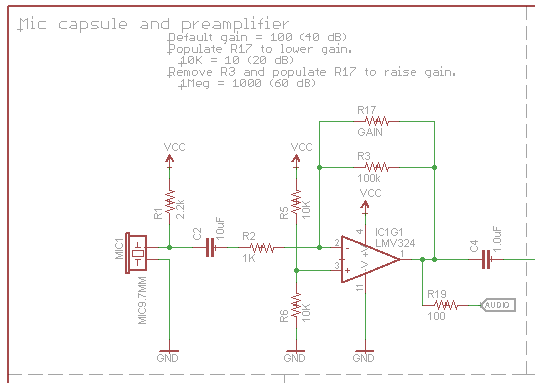
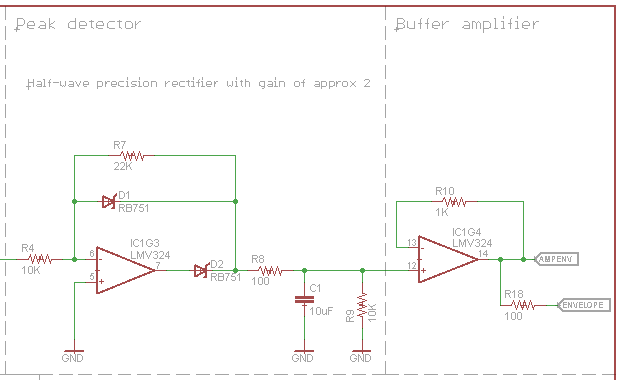
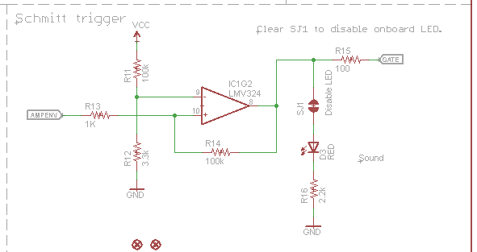

# SparkFun Sound Detector Hookup Guide

	pic - default product img

The Sound Detector is a small board that combines a microphone and some processing circuitry.  It provides not only an audio output, but also a binary indication of the presence of sound and an analog representation of it's amplitude. 

### Quick Start

To get started with the Sound Detector, simply connect it to a power supply

(Sound Detector → Power Supply )

* GND → Supply Ground
* VCC → Power supply voltage between 3.5 and 5.5 Volts

In a quiet room, power the board up, and then speak into the microphone.  You should see the red LED on the 
board blink in response to your voice.

	pic - blinking

With it's 3 outputs, the board itself is a lot more flexible.  To explore that flexibility, read on.

---
## 3 Outputs?

The Sound Detector has 3 separate outputs.  

It's easiest to see what each is doing with a graph.

	waveforms
 
This illustrates the output voltages over time 

* The dark green trace is the audio output of the sound detector.  The voltage directly from the microphone is found at this output.
* The light green trace is the envelope output.  This analog voltage traces the amplitude of the sound.
* Finally, the red line is the gate output.  This output is low when conditions are quiet, and goes high when sound is detected. 

### How It Works

Having examined the outputs, lets also take a quick walk through the schematic, to gain an understanding of how each stage works. 

#### First Stage

The first section of the circuit is an electret microphone capsule.  The capsule is biased by the supply voltage, and it outputs an AC voltage that is riding a DC offset of approximately 1/2 the supply voltage.  

The `audio` output is riding that bias voltage, so it can be directly connected to the ADC of a microcontroller.

The output from the capsule is an extremely small voltage, so the signal from the capsule is amplified by IC1G1, an operational amplifier stage.  By default, the preamplifier has an arithmetic gain of 100 (20 dB), and the gain can be adjusted by populating R17 (See `link to later`)

#### Second Stage

The second stage of the processing is an envelope follower.  IC1G3 forms an opamp-based precision rectifier.  This stage implements the equation
 
	Vout = if(Vin > 0) 
				then 0,
		   else
				Vin * -2.2

The opamp inverts and amplifies the signal.  When it's output swings high, D2 turns on, and charges C1.  When the signal is not swinging, D2 is turned off, and C1 discharges through R9.  Thus, C1 tracks the peaks of the input signal.

IC1G4 is a buffer amplifier, so external loads on the envelope pin won't change the C1's charge/discharge behavior. 

This results in a signal that tracks the peak amplitude of the input signal.  A louder sound will result in a higher voltage on the Envelope pin.

#### Third Stage

The Schmitt trigger watches the envelope signal, and toggles the output when the threshold is exceeded.  The Schmitt trigger is a comparator that adjusts it's threshold voltage when the output switches, requiring a higher voltage to switch on than to switch off.  This allows it to ignore some ripple in the input signal, like the ripple present in the output of the envelope follower stage.

---
### Configuration

#### Care and Feeding Of The Capsule

The heart of the Sound Detector is the electret microphone capsule - without it, we couldn't convert acoustic energy into electrical energy.  These capsules have a couple of quirks that we need to understand in order to apply them successfully.

Inside the capsule are the diaphragm, which is actually one plate of a small capacitor.  That capacitor forms a voltage divider with the external bias resistor - it moves in response to sound, and the capacitance changes as the plates get closer or farther apart, causing the divider to change.  Since capacitors are sensitive to loading, it's internally buffered with a JFET (junction field effect transistor).

Due to the mechanical and electronic tolerances involved, some capsules are more sensitive than others.  Also, the JFET is rather sensitive to noise on the power supply.  Both of these factors need to be accounted for when deploying the Sound Detector. 

##### Power Supply

The sound detector is an analog circuit, and as such, it's more sensitive to noise on the power supply than most digital circuits.  Since the capsule is effectively a voltage divider sitting across the power rails of the board, it will transcribe any noise on the supply lines onto the capsule output.  Since the next circuit in the chain is a high-gain amplifier, any noise on the supply will then be amplified.  Therefore, the Sound Detector may require more careful power supply configuration than many circuits.

In testing with various supplies, a significant degree of variability was discovered - some supplies are more solid than others.  One exhibited as much as 30 mV ripple on the supply output, the the Sound Detector was rather sensitive and unstable.  You can check how clean a power supply is by measuring it with a volt meter, set to the AC Volts (or, is provided, the AV millivolts) range.  A truly clean supply will show 0.000 VAC.  Of the supplies used in testing, ripple of more than about 10 mV is problematic.

Powering my Arduino with a 9V external supply, using an [LM317](https://www.sparkfun.com/products/527) regulator, which allows the onboard regulators to function, the external voltage outputs were sufficiently clean.  Running it from the 5V available on the USB port on my PC, the regulators are bypassed, and the results were somewhat less usable.  

If all else fails, 3 1.5V batteries make a nice, clean source of 4.5V.

##### Amplitude Calibration

The Sound Detector comes set for moderate sensitivity - speaking directly into the microphone, or clapping your hands nearby should cause the gate output to fire.  If you find that it doesn't work well in a specific application, you can change the circuit to be more or less sensitive.

The gain is set by changing the feedback resistors in the preamp stage.  The resistors are marked in the silkscreen on the PCB.

	pic - closeup of R's

R3 is the surface mount part, with 100K Ohm populated by default.  R17 is an unpopulated position for a through hole resistor. 

##### Lowering The gain

It's most likely that you'll find the detector to be too sensitive.  In testing the board for this writeup, noisy air conditioning and music in the next office over were enough to set it off.  To make the board less sensitive, you can lower the preamplifier gain by populating R17 in parallel with R3.

<table border="1" align="center" width="500">
<tr align="center"><td><b>R3 Value</b></td><td><b>R17 Value</b></td><td><b>Arithmetic Gain</b></td><td><b>Gain (dB)</b></td></tr>
<tr align="center"><td>100K</td><td>-</td><td>100</td><td>40</td></tr>
<tr align="center"><td>100K</td><td>100K</td><td>50</td><td>33</td></tr>
<tr align="center"><td>100K</td><td>47K</td><td>32</td><td>30</td></tr>
<tr align="center"><td>100K</td><td>22K</td><td>18</td><td>25</td></tr>
<tr align="center"><td>100K</td><td>10K</td><td>9</td><td>19</td></tr>
<tr align="center"><td>100K</td><td>4.7K</td><td>4</td><td>13</td></tr>
<tr align="center"><td>100K</td><td>2.2K</td><td>2</td><td>6</td></tr>
</table>

##### Raising The gain

If you want to make the sound detector more sensitive, so that it will be activated by quieter sounds, you can remove R3, and populate R17.

<table border="1" align="center" width="500">
<tr align="center"><td><b>R17 Value</b></td><td><b>Arithmetic Gain</b></td><td><b>Gain (dB)</b></td></tr>
<tr align="center"><td>100K</td><td>220</td><td>40</td></tr>
<tr align="center"><td>220K</td><td>470</td><td>46</td></tr>
<tr align="center"><td>470K</td><td>1000</td><td>53</td></tr>
<tr align="center"><td>1Meg</td><td>9</td><td>60</td></tr>
</table>

---
#### Lights Out

In some applications, the onboard LED may be distracting or undesirable.  To disable it, simply use a solder sucker or wick to remove the solder blob on SJ1.

	pic of SJ1

---
## Example Code

(Sound Detector → Arduino )

* GND → Supply Ground
* VCC → Power supply voltage between 3.5 and 5.5 Volts
* Gate → Pin 2
* Envelope → A0

Additionally, as described on the [calibration page](...), a 33K Ohm resistor was soldered into position R17.  R3 was left in place, so the gain was lowered from 40 dB to about 28 dB.
	

This code simultaneously demonstrates two different operating modes of the Sound Detector.  

* First, using the pin change interrupt facility, 
* Second, is uses an analog input to periodically sample the envelop signal.  It uses a series of thresholds to display the relative loudness level on the serial port. 

Hmmm...catch pin change - set LED.
Also sample env in loop, and print occasional messages of loudness?  Quiet, moderate, loud...

This sketch
...uses the pin change interrupt library

When the gate pin goes high ...

...also, outside of the interrupt, ...

---
## Analog Variant

---

## Troubleshooting:
-noisy supply!!
-better at 5V...
-sensitive to handling noise & vibration
	- "dead cat" for wind noise
	- 
## Documentation
* Demo Code 
* SPICE files